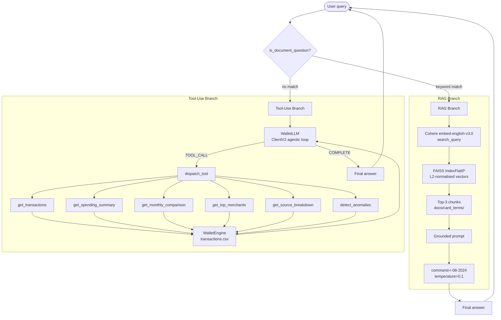

# Smart Wallet · AI Financial Dashboard


---

## Architecture Overview



---

## Product Overview

Smart Wallet is a multi-source AI financial dashboard that aggregates transaction data across **live bank accounts** (via TrueLayer sandbox OAuth2) and **Kaggle CSV** data (Revolut, Visa Classic) simultaneously — the same model as Google Pay or Apple Wallet. It surfaces spending breakdowns, monthly trends, top-merchant rankings, and anomaly detection in a single filterable interface.

On top of the analytics layer sits a two-route AI assistant powered by the Cohere API. Transaction questions (e.g. "How much did I spend on food last month?") are answered in real time through structured tool calls against the underlying dataset. Questions about card fees, benefits, or terms (e.g. "What are Revolut's foreign transaction fees?") are answered through RAG over curated card-terms documents, with the model quoting only information present in the source files. An AI Strategist tab generates actionable financial plans per topic, with a thumbs up/down feedback loop that tracks helpfulness over time. A dedicated AI Lab tab lets users evaluate and compare two categorisation models and correct low-confidence predictions through a human-in-the-loop interface.

---

## Technical Architecture

### Data Pipeline

Raw transaction data originates from the [Kaggle fraud-detection dataset](https://www.kaggle.com/datasets/kartik2112/fraud-detection) (1.85 M rows across training and test CSVs). `data/loader.py` processes it as follows:

1. Loads `fraudTrain.csv` and `fraudTest.csv`, concatenates them.
2. Extracts the full category vocabulary dynamically from the `category` column — no hardcoded mapping.
3. Applies `clean_category()` to normalise raw strings (e.g. `food_dining_pos` → `Food & Dining`).
4. Stratified-samples ~5 000 rows (proportional per category) for app performance.
5. Assigns each transaction to one of five payment sources based on the last two digits of `cc_num`.
6. Derives `Is_Recurring` from merchant frequency (≥ 3 transactions).
7. Saves the processed schema to `data/processed/transactions.csv`.

### LLM Engine (`models/llm_engine.py`)

Uses **Cohere ClientV2** (v5 SDK) with the `command-r-08-2024` model in an agentic loop (max 5 iterations):

- Tool definitions follow the OpenAI-compatible function-calling schema.
- `finish_reason == "COMPLETE"` → extract text from content blocks and return.
- `finish_reason == "TOOL_CALL"` → append the full `response.message` object (preserves `tool_calls`), execute each tool via `dispatch_tool()`, append `{"role": "tool", "tool_call_id": ..., "content": ...}` results, and loop.
- A `_extract_text()` helper handles Cohere v5 content-block lists.

### RAG Engine (`models/rag_engine.py`)

Handles card-terms Q&A with a lazy-built FAISS index:

- Documents: four `.txt` files in `docs/card_terms/` covering Revolut, PayPal, Trade Republic, and Visa/Mastercard.
- Chunking: 150-word windows with 30-word overlap.
- Embeddings: `cohere.Client` (v1) with `embed-english-v3.0`, `input_type="search_document"` for index, `input_type="search_query"` for queries.
- Index: `faiss.IndexFlatIP` over L2-normalised vectors (cosine similarity via inner product).
- Retrieval: top-3 chunks passed as a grounded prompt to `command-r-08-2024` at temperature 0.1.

### Categorisation (`models/categorizer.py`)

Two interchangeable models seeded from actual dataset merchant→category pairs at init:

| Model | Method | Threshold | Notes |
|---|---|---|---|
| `TFIDFCategorizer` | TF-IDF + cosine similarity | 0.20 | Bigrams, no API calls |
| `EmbeddingCategorizer` | Cohere `embed-english-v3.0` + cosine | 0.30 | Requires `COHERE_API_KEY` |

Both expose the same `predict(description) → (category, confidence, is_uncertain)` and `train(description, category)` interface. Knowledge base is seeded from `df.drop_duplicates("Raw_Description")` at construction time.

### Evaluation (`models/evaluator.py`)

`evaluate_categorizer()` runs a stratified sample (proportional per class) against Kaggle ground-truth labels and returns per-class precision, recall, F1, plus macro averages. `get_metrics_dataframe()` shapes results for Plotly bar charts in the AI Lab tab.

---

## Routing Logic

The AI assistant routes each query before any LLM call:

```python
# models/rag_engine.py — RAGEngine.is_document_question()
keywords = [
    "annual fee", "cashback", "reward", "interest", "apr",
    "foreign transaction", "travel insurance", "lounge", "benefit",
    "limit", "withdrawal", "fee", "charge", "terms", "condition",
    "coverage", "protection", "minimum payment", "late fee",
    "credit limit", "points", "miles", "membership", "plan",
]
return any(kw in query.lower() for kw in keywords)
```

- **Keyword match → RAG branch**: query embedded, top-3 chunks retrieved from FAISS index, grounded answer generated from card-terms documents only.
- **No keyword match → Tool-use branch**: `WalletLLM` agentic loop calls up to six structured tools against `WalletEngine`, then synthesises a natural-language answer.

---

## Repository Structure

```
digital-wallet-prototype/
├── .streamlit/
│   └── config.toml              # Stripe-inspired theme (primaryColor #635BFF)
├── data/
│   ├── loader.py                # Kaggle CSV → processed schema, dynamic categories
│   ├── raw/                     # gitignored — fraudTrain.csv, fraudTest.csv
│   └── processed/
│       └── transactions.csv     # Committed processed dataset (~5 000 rows)
├── docs/
│   └── card_terms/
│       ├── paypal_terms.txt         # PayPal fees, buyer protection, FX rates
│       ├── revolut_terms.txt        # Revolut plans, ATM limits, cashback
│       ├── trade_republic_terms.txt # Trade Republic interest, cashback, fees
│       └── visa_mastercard_terms.txt# Visa Classic & Mastercard Gold terms
├── models/
│   ├── bank_connector.py        # TrueLayerAdapter — OAuth2, token refresh, transaction fetch
│   ├── categorizer.py           # TFIDFCategorizer + EmbeddingCategorizer
│   ├── evaluator.py             # Precision / recall / F1 evaluation harness
│   ├── llm_engine.py            # Cohere ClientV2 agentic loop + tool dispatch
│   ├── rag_engine.py            # FAISS RAG engine over card-terms docs
│   └── wallet_engine.py         # Six LLM-callable tools over transactions.csv
├── tests/
│   ├── test_bank_connector.py   # TrueLayerAdapter unit tests (auth, schema, dedup)
│   └── test_wallet_engine.py    # WalletEngine unit tests (95 tests total)
├── .env.example                 # API key template — copy to .env
├── .gitignore
├── app.py                       # Streamlit UI — 4 tabs
├── requirements.txt             # Pinned dependencies for Streamlit Cloud
└── README.md
```

---

## Setup

### Prerequisites

- Python 3.11+
- [Cohere API key](https://dashboard.cohere.com/) (free tier sufficient)
- [Kaggle API credentials](https://www.kaggle.com/settings) (for data download)

### Local installation

```bash
# 1. Clone and enter the repo
git clone https://github.com/<your-handle>/digital-wallet-prototype.git
cd digital-wallet-prototype

# 2. Create and activate a virtual environment
python3 -m venv wallet_venv
source wallet_venv/bin/activate        # Windows: wallet_venv\Scripts\activate

# 3. Install dependencies
pip install -r requirements.txt

# 4. On macOS, faiss-cpu requires swig
brew install swig
pip install faiss-cpu

# 5. Configure API key
cp .env.example .env
# Edit .env and set COHERE_API_KEY=<your_key>
```

### Streamlit Cloud deployment

Add keys in **Manage app → Secrets**:

```toml
COHERE_API_KEY          = "your_key_here"
TRUELAYER_CLIENT_ID     = "your_truelayer_client_id"
TRUELAYER_CLIENT_SECRET = "your_truelayer_client_secret"
TRUELAYER_REFRESH_TOKEN = "your_refresh_token"
```

No Kaggle credentials are needed on Streamlit Cloud — `data/processed/transactions.csv` is committed to the repository. Without TrueLayer credentials the app degrades gracefully to CSV-only mode.

---

## Data Pipeline

| Step | Detail |
|---|---|
| **Source dataset** | [Kaggle fraud-detection](https://www.kaggle.com/datasets/kartik2112/fraud-detection) — 1.85 M credit-card transactions |
| **Download** | `kaggle datasets download -d kartik2112/fraud-detection -p data/raw --unzip` |
| **Processing** | `python3 data/loader.py` — stratified sample of ~5 000 rows |
| **Category extraction** | Dynamic from dataset `category` column — 14 categories after cleaning |
| **Source assignment** | Deterministic from `cc_num % 5` → one of 5 payment sources |
| **Output** | `data/processed/transactions.csv` — 9 columns, committed to repo |

Categories present in the dataset (dynamically extracted at runtime):

`Entertainment`, `Food & Dining`, `Gas & Transport`, `Grocery`, `Health & Fitness`, `Home`, `Kids`, `Misc`, `Personal Care`, `Shopping`, `Travel`

---

## Model Evaluation

Results below are indicative — run **AI Lab → Model Comparison** in the app to reproduce against your local dataset sample.

| Metric | TF-IDF Baseline | Cohere Embeddings | Delta |
|---|---|---|---|
| Accuracy | TBD | TBD | TBD |
| Macro Precision | TBD | TBD | TBD |
| Macro Recall | TBD | TBD | TBD |
| Macro F1 | TBD | TBD | TBD |
| Avg Confidence | TBD | TBD | TBD |

Both models are seeded from the full merchant→category mapping extracted from the dataset at initialisation time. The TF-IDF model uses bigrams and a cosine similarity threshold of 0.20; the embedding model uses `embed-english-v3.0` with a threshold of 0.30.

---

## Live Demo

[**→ Open on Streamlit Cloud**](https://digitalwalletprototype-26r8y6nikossaxzzff47if.streamlit.app/)

> The live demo requires a valid `COHERE_API_KEY` to be set in Streamlit Cloud Secrets. Without it, the **AI Assistant** and **Cohere Embeddings** evaluation mode are disabled; all other tabs remain fully functional.

---

*Smart Wallet · Prototype v3 · Powered by Cohere + TrueLayer · Built with Streamlit*
